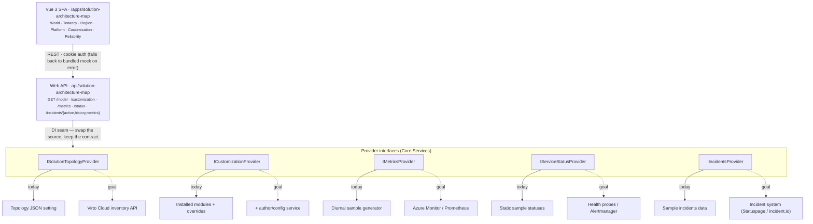

# Architecture — services & data sources

One principle runs through the module: **the Vue app and the REST API never change as the product matures — only what sits behind each provider interface does.** Today most providers read admin configuration or ship sample data; the goal is to swap each binding for a live system, one interface at a time, with zero UI or contract churn.

## Request flow & the swap seam



The SPA and the four endpoints are fixed. Each provider interface is the single point where a sample/config source is swapped for a live one — nothing above the interface changes.

## Services (provider interfaces)

| Service (`Core.Services`) | Endpoint | Bound today to (`Data.Services`) | Source | Goal source |
|---|---|---|---|---|
| `ISolutionTopologyProvider` | `GET /model` | `StaticTopologyProvider` — reads the `Topology` JSON setting (+ project info, running platform version, catalog size) | Setting | Virto Cloud infrastructure / inventory API (regions, tenants, datacenters, replication) |
| `ICustomizationProvider` | `GET /customization` | `ManifestCustomizationProvider` — real installed-module manifest + `CustomizationOverrides` setting | Live-ish | + author/config service for standard-vs-custom classification |
| `IMetricsProvider` | `GET /metrics` | `SampleMetricsProvider` — deterministic follow-the-sun generator seeded by the topology | Sample | Azure Monitor / App Insights / Prometheus–Grafana |
| `IServiceStatusProvider` | `GET /status` | `SampleStatusProvider` — static component states | Sample | K8s health probes / Azure Monitor / Alertmanager |
| `IIncidentsProvider` | `GET /incidents/{active,history,metrics}` | `SampleIncidentsProvider` — three methods: active incidents (several), paginated/filtered history, business metrics; the SPA reads these (bundled mock fallback for dev/demo) | Sample | incident system (Statuspage / incident.io / internal); region health derived from live status |
| `ICatalogSizeReader` | feeds `/model` | `SearchCatalogSizeReader` — search-index `Product` document count via `ISearchProvider` (soft dependency, cached 5 min) | **Live** | same — already live |

Supporting readers (all `Data.Services`, injected into the providers): `ITopologyReader → SettingsTopologyReader`, `IProjectInfoReader → SettingsProjectInfoReader`, `IOverridesReader → SettingsOverridesReader`, `IInstalledModulesReader → LocalInstalledModulesReader`.

## Data sources: today → goal

| Maturity | What | Source today |
|---|---|---|
| **Live** | Installed-module catalog (customization), search-index catalog size, running platform version | Platform APIs / search index |
| **Configuration** | Topology, project branding, customization overrides | JSON settings (editable in the back office) |
| **Sample / generated** | Per-region metrics, service status, reliability & incidents | Deterministic sample providers (`/metrics`, `/status`, `/incidents`) |

## Dependency injection — the swap point

All providers and their readers are registered in `Web/Module.cs → Initialize()`. Going live means changing **only the right-hand side** — the controller, the DTOs, and the whole SPA stay unchanged:

```csharp
public void Initialize(IServiceCollection serviceCollection)
{
    serviceCollection.AddSingleton<Data.Services.ITopologyReader, Data.Services.SettingsTopologyReader>();
    serviceCollection.AddSingleton<Data.Services.ICatalogSizeReader, Data.Services.SearchCatalogSizeReader>();
    serviceCollection.AddSingleton<Core.Services.ISolutionTopologyProvider, Data.Services.StaticTopologyProvider>();
    serviceCollection.AddSingleton<Core.Services.IMetricsProvider, Data.Services.SampleMetricsProvider>();
    serviceCollection.AddSingleton<Core.Services.IServiceStatusProvider, Data.Services.SampleStatusProvider>();
    serviceCollection.AddSingleton<Data.Services.IInstalledModulesReader, Data.Services.LocalInstalledModulesReader>();
    serviceCollection.AddSingleton<Data.Services.IOverridesReader, Data.Services.SettingsOverridesReader>();
    serviceCollection.AddSingleton<Data.Services.IProjectInfoReader, Data.Services.SettingsProjectInfoReader>();
    serviceCollection.AddSingleton<Core.Services.ICustomizationProvider, Data.Services.ManifestCustomizationProvider>();
    serviceCollection.AddSingleton<Core.Services.IIncidentsProvider, Data.Services.SampleIncidentsProvider>();
}
```

> To go live for a signal — e.g. real metrics — implement `IMetricsProvider` against Azure Monitor and change one line: `AddSingleton<IMetricsProvider, AzureMonitorMetricsProvider>()`. The response keeps its shape and the `dataSource` flag flips to `"live"`.

## Module layout

| Project | Responsibility |
|---|---|
| `…Core` | DTOs (`SolutionMapModel`, `CustomizationResult`, …), `ModuleConstants` (settings + permissions), provider **interfaces** |
| `…Data` | Provider **implementations** and readers (`Data/Services`) |
| `…Web` | Controller (`api/solution-architecture-map`), `Module.cs` (DI + settings + permissions), `Content/solution-architecture-map` (built SPA), and the `client-app` Vue source |

The SPA (`client-app`) is a Vue 3 + Vite + TypeScript app; `npm run build` emits the static bundle into `Web/Content/solution-architecture-map`, which the platform serves at `/apps/solution-architecture-map`.
